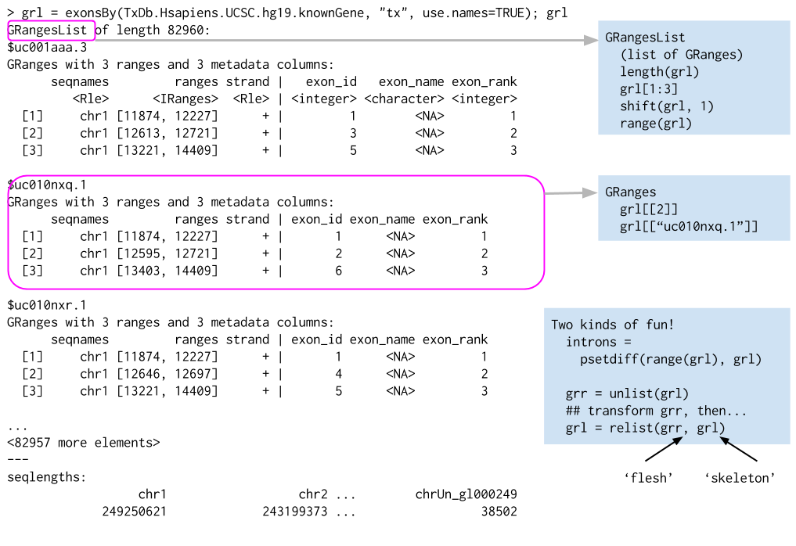
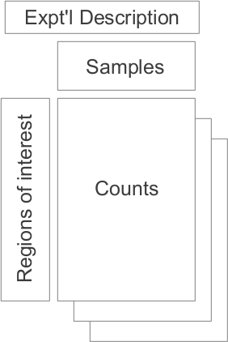

```{r style, echo = FALSE, results = 'asis'}
BiocStyle::markdown()
options(width=100, max.print=1000)
knitr::opts_chunk$set(
    eval=as.logical(Sys.getenv("KNITR_EVAL", "FALSE")),
    cache=as.logical(Sys.getenv("KNITR_CACHE", "TRUE")))
```

```{r setup, echo=FALSE, messages=FALSE, warnings=FALSE}
suppressPackageStartupMessages({
    library(shiny)
    library(GenomicRanges)
    library(TxDb.Hsapiens.UCSC.hg19.knownGene)
    library(org.Hs.eg.db)
    library(Homo.sapiens)
    library(AnnotationHub)
    library(RNAseqData.HNRNPC.bam.chr14)
    library(GenomicAlignments)
    library(Rsamtools)
    library(airway)
    library(DESeq2)
})
```

Authors: Martin Morgan (<a
  href="mailto:mtmorgan@fhcrc.org">mtmorgan@fhcrc.org</a>), Sonali
  Arora (<a
  href="mailto:sarora@fredhutch.org">sarora@fredhutch.org</a>)<br />
Date: 30 June, 2015<br />


# Analysis & Comprehension of High Throughput Sequence Data


## Overall workflow

1. Experimental design
    - Keep it simple!
    - Replication!
    - Avoid or track batch effects
2. Wet-lab preparation
3. High-throughput sequencing
    - Output: FASTQ files of reads and their quality scores
4. Alignment
    - Many different aligners, some specialized for different purposes
    - Output: BAM files of aligned reads
5. Summary
    - e.g., _count_ of reads overlapping regions of interest (e.g., genes)
6. Statistical analysis
7. Comprehension


Notes

- de novo _Assembly_ outside the scope of _Bioconductor_

## A simple _shiny_ app

## How _Bioconductor_ helps

Annotation

- Gene (e.g., exons-within-transcipts) models 
- Identifier mapping (e.g., 'HNRPC' to Entrez identifier used in
  the gene model)

Standard (large) file input & manipulation, e.g., BAM files of aligned reads

Statistical analysis of differential expression
  
# Annotation

## Gene models -- `TxDb`, `GRanges`, and `GRangesList`

### Gene model annotation resources -- `TxDb` packages

[TxDb.Hsapiens.UCSC.hg19.knownGene][]

```{r gene-model-discovery}
library("TxDb.Hsapiens.UCSC.hg19.knownGene")
txdb <- TxDb.Hsapiens.UCSC.hg19.knownGene
txdb
methods(class=class(txdb))
```

`TxDb` objects

- Curatated annotation resources -- http://bioconductor.org/packages/biocViews
- Underlying sqlite database -- `dbfile(txdb)`
- Make your own: `GenomicFeatures::makeTxDbFrom*()`

Accessing gene models

- `exons()`, `transcripts()`, `genes()`, `cds()` (coding sequence)
- `promoters()` & friends
- `exonsBy()` & friends -- exons by gene, transcript, ...
- 'select' interface: `keytypes()`, `columns()`, `keys()`, `select()`,
  `mapIds()`

### Genomic ranges -- `GRanges`

`exons()`: _GRanges_

```{r txdb-exons}
exons(txdb)
```


`methods(class="GRanges")`: 100's!

_GRanges_ Algebra

- Intra-range methods
    - Independent of other ranges in the same object
    - GRanges variants strand-aware
    - `shift()`, `narrow()`, `flank()`, `promoters()`, `resize()`,
      `restrict()`, `trim()`
    - See `?"intra-range-methods"`
- Inter-range methods
    - Depends on other ranges in the same object
    - `range()`, `reduce()`, `gaps()`, `disjoin()`
    - `coverage()` (!)
    - see `?"inter-range-methods"`
- Between-range methods
    - Functions of two (or more) range objects
    - `findOverlaps()`, `countOverlaps()`, ..., `%over%`, `%within%`,
      `%outside%`; `union()`, `intersect()`, `setdiff()`, `punion()`,
      `pintersect()`, `psetdiff()`

### Lists of genomic ranges -- `GRangesList`

`exonsBy()`: _GRangesList_

```{r txdb-exonsby}
exonsBy(txdb, "tx")
```



### Algebra of genomic ranges

_GRanges_ / _GRangesList_ are incredibly useful

- Represent **annotations** -- genes, variants, regulatory elements,
  copy number regions, ...
- Represent **data** -- aligned reads, ChIP peaks, called variants,
  ...
  
Many biologically interesting questions represent operations on ranges

- Count overlaps between aligned reads and known genes --
  `GenomicRanges::summarizeOverlaps()`
- Genes nearest to regulatory regions -- `GenomicRanges::nearest()`,
  [ChIPseeker][]
- Called variants relevant to clinical phenotypes -- 
  [VariantFiltering][]


## Identifier mapping -- `OrgDb`

```{r org}
library(org.Hs.eg.db)
org.Hs.eg.db
```

`OrgDb` objects

- Curated resources, underlying sqlite data base, like `TxDb`
- make your own: [AnnotationForge][] (but see the AnnotationHub,
  below!)
- 'select' interface: `keytypes()`, `columns()`, `keys()`, `select()`,
  `mapIds()`

`select()`

- Vector of keys, desired columns
- Specification of key type

    ```{r select}
    select(org.Hs.eg.db, c("BRCA1", "PTEN"), c("ENTREZID", "GENENAME"), "SYMBOL")
    keytypes(org.Hs.eg.db)
    columns(org.Hs.eg.db)
    ```

Related functionality 

- `mapIds()` -- special case for mapping from 1 identifier to another
- `OrganismDb` objects: combined `org.*`, `TxDb.*`, and other
  annotation resources for easy access

    ```{r organismdb}
    library(Homo.sapiens)
    select(Homo.sapiens, c("BRCA1", "PTEN"), 
           c("TXNAME", "TXCHROM", "TXSTART", "TXEND"), 
           "SYMBOL")
    ```
    
## Other annotation resources -- `biomaRt`, `AnnotationHub`

### _biomaRt_ & friends

http://biomart.org; _Bioconductor_ package [biomaRt][]

```{r biomart, eval=FALSE}
## NEEDS INTERNET ACCESS !!
library(biomaRt)
head(listMarts(), 3)                      ## list marts
head(listDatasets(useMart("ensembl")), 3) ## mart datasets
ensembl <-                                ## fully specified mart
    useMart("ensembl", dataset = "hsapiens_gene_ensembl")

head(listFilters(ensembl), 3)             ## filters
myFilter <- "chromosome_name"
substr(filterOptions(myFilter, ensembl), 1, 50) ## return values
myValues <- c("21", "22")
head(listAttributes(ensembl), 3)          ## attributes
myAttributes <- c("ensembl_gene_id","chromosome_name")

## assemble and query the mart
res <- getBM(attributes =  myAttributes, filters =  myFilter,
             values =  myValues, mart = ensembl)
```

Other internet resources

- [biomaRt](http://biomart.org)                       Ensembl and other annotations
- [PSICQUIC](https://code.google.com/p/psicquic)      Protein interactions
- [uniprot.ws](http://uniprot.org)                    Protein annotations
- [KEGGREST](http://www.genome.jp/kegg)               KEGG pathways
- [SRAdb](http://www.ncbi.nlm.nih.gov/sra)            Sequencing experiments
- [rtracklayer](http://genome.ucsc.edu)               USCS genome tracks
- [GEOquery](http://www.ncbi.nlm.nih.gov/geo/)        Array and other data
- [ArrayExpress](http://www.ebi.ac.uk/arrayexpress/)  Array and other data
- ...

### _AnnotationHub_

- _Bioconductor_ package [AnnotationHub][]
- Meant to ease use of 'consortium' and other genome-scale resources
- Simplify discovery, retrieval, local management, and import to
  standard _Bioconductor_ representations

Example: Ensembl 'GTF' files to _R_ / _Bioconductor_ GRanges and TxDb

```{r annotationhub-gtf, eval=FALSE}
library(AnnotationHub)
hub <- AnnotationHub()
hub
query(hub, c("Ensembl", "80", "gtf"))
## ensgtf = display(hub)                   # visual choice
hub["AH47107"]
gtf <- hub[["AH47107"]]
gtf
txdb <- GenomicFeatures::makeTxDbFromGRanges(gtf)
```

Example: non-model organism `OrgDb` packages

```{r annotationhub-orgdb, eval=FALSE}
library(AnnotationHub)
hub <- AnnotationHub()
query(hub, "OrgDb")
```

Example: Map Roadmap epigenomic marks to hg28

- Roadmap BED file as _GRanges_

    ```{r annotationhub-roadmap, eval=FALSE}
    library(AnnotationHub)
    hub <- AnnotationHub()
    query(hub , c("EpigenomeRoadMap", "E126", "H3K4ME2"))
    E126 <- hub[["AH29817"]]
    ```

- UCSC 'liftOver' file to map coordinates

    ```{r annotationhub-liftover, eval=FALSE}
    query(hub , c("hg19", "hg38", "chainfile"))
    chain <- hub[["AH14150"]]
    ```

- lift over -- possibly one-to-many mapping, so _GRanges_ to _GRangesList_

    ```{r liftover, eval=FALSE}
    library(rtracklayer)
    E126hg38 <- liftOver(E126, chain)
    E126hg38
    ```

# Input & representation of standard file formats

## BAM files of aligned reads -- `GenomicAlignments`

Recall: overall workflow

1. Experimental design
2. Wet-lab preparation
3. High-throughput sequencing
4. Alignment
     - Whole genome, vs. transcriptome
5. Summary
6. Statistical analysis
7. Comprehension

BAM files of aligned reads

- Header

        @HD     VN:1.0  SO:coordinate
        @SQ     SN:chr1 LN:249250621
        @SQ     SN:chr10        LN:135534747
        @SQ     SN:chr11        LN:135006516
        ...
        @SQ     SN:chrY LN:59373566
        @PG     ID:TopHat       VN:2.0.8b       CL:/home/hpages/tophat-2.0.8b.Linux_x86_64/tophat --mate-inner-dist 150 --solexa-quals --max-multihits 5 --no-discordant --no-mixed --coverage-search --microexon-search --library-type fr-unstranded --num-threads 2 --output-dir tophat2_out/ERR127306 /home/hpages/bowtie2-2.1.0/indexes/hg19 fastq/ERR127306_1.fastq fastq/ERR127306_2.fastq
  
- Alignments
    - ID, flag, alignment and mate
  
            ERR127306.7941162       403     chr14   19653689        3       72M             =       19652348        -1413  ...
            ERR127306.22648137      145     chr14   19653692        1       72M             =       19650044        -3720  ...
            
    - Sequence and quality
        
            ... GAATTGATCAGTCTCATCTGAGAGTAACTTTGTACCCATCACTGATTCCTTCTGAGACTGCCTCCACTTCCC        *'%%%%%#&&%''#'&%%%)&&%%$%%'%%'&*****$))$)'')'%)))&)%%%%$'%%%%&"))'')%))
            ... TTGATCAGTCTCATCTGAGAGTAACTTTGTACCCATCACTGATTCCTTCTGAGACTGCCTCCACTTCCCCAG        '**)****)*'*&*********('&)****&***(**')))())%)))&)))*')&***********)****
        
    - Tags

            ... AS:i:0  XN:i:0  XM:i:0  XO:i:0  XG:i:0  NM:i:0  MD:Z:72 YT:Z:UU NH:i:2  CC:Z:chr22      CP:i:16189276   HI:i:0
            ... AS:i:0  XN:i:0  XM:i:0  XO:i:0  XG:i:0  NM:i:0  MD:Z:72 YT:Z:UU NH:i:3  CC:Z:=  CP:i:19921600   HI:i:0

- Typically, sorted (by position) and indexed ('.bai' files)

[GenomicAlignments][]

- Use an example BAM file (`fl` could be the path to your own BAM file)

    ```{r genomicalignments}
    ## example BAM data
    library(RNAseqData.HNRNPC.bam.chr14)
    ## one BAM file
    fl <- RNAseqData.HNRNPC.bam.chr14_BAMFILES[1]
    ## Let R know that this is a BAM file, not just a character vector
    library(Rsamtools)
    bfl <- BamFile(fl)
    ```
- Input the data into R

    ```{r readgalignments}
    aln <- readGAlignments(bfl)
    aln
    ```

    - `readGAlignmentPairs()` / `readGAlignmentsList()` if paired-end
      data
    - Lots of things to do, including all the _GRanges_ /
      _GRangesList_ operations
      
    ```{r galignments-methods}
    methods(class=class(aln))
    ```

- **Caveat emptor**: BAM files are large. Normally you will
  _restrict_ the input to particular genomic ranges, or _iterate_
  through the BAM file. Key _Bioconductor_ functions (e.g.,
  `GenomicAlignments::summarizeOverlaps()` do this data management
  step for you. See next section!

## Other formats and packages


## Large data -- `BiocParallel`, `GenomicFiles`

### Restriction

- Input only the data necessary, e.g., `ScanBamParam()`
- `which`: genomic ranges of interest
- `what`: 'columns' of BAM file, e.g., 'seq', 'flag'

### Iteration

- Read entire file, but in chunks
- Chunk size small enough to fit easily in memory, 
- Chunk size large enough to benefit from _R_'s vectorized operations
  -- 10k to 1M records at at time
- e.g., `BamFile(..., yieldSize=100000)`

Iterative programming model

- _yield_ a chunk of data
- _map_ input data to convenient representation, often summarizing
  input to simplified form
    - E.g., Aligned read coordinates to counts overlapping regions of
      interest
    - E.g., Aligned read sequenced to GC content
- _reduce_ across mapped chunks
- Use `GenomicFiles::reduceByYield()`

    ```{r iteration}
    library(GenomicFiles)

    yield <- function(bfl) {
        ## input a chunk of alignments
        library(GenomicAlignments)
        readGAlignments(bfl, param=ScanBamParam(what="seq"))
    }
    
    map <- function(aln) { 
        ## Count G or C nucleotides per read
        library(Biostrings)
        gc <- letterFrequency(mcols(aln)$seq, "GC")
        ## Summarize number of reads with 0, 1, ... G or C nucleotides
        tabulate(1 + gc, 73)                # max. read length: 72
    }
    
    reduce <- `+`
    ```

- Example

    ```{r iteration-doit}
    library(RNAseqData.HNRNPC.bam.chr14)
    fls <- RNAseqData.HNRNPC.bam.chr14_BAMFILES
    bf <- BamFile(fls[1], yieldSize=100000)
    gc <- reduceByYield(bf, yield, map, reduce)
    plot(gc, type="h",
         xlab="GC Content per Aligned Read", ylab="Number of Reads")
    ```

# Statistical analysis of differential expression -- `DESeq2`

1. Experimental design
2. Wet-lab preparation
3. High-throughput sequencing
4. Alignment
    - Whole-genome, or transcriptome
5. Summary
    - Count reads overlapping regions of interest:
      `GenomicAlignments::summarizeOverlaps()`
6. **Statistical analysis**
    - [DESeq2][], [edgeR][]
7. Comprehension

More extensive material

- [edgeR][] and [limma][] vignettes.
- [DESeq2][] vignette.
- [airway][] vignette for alignment and summary stages.
- [RNA-Seq workflow](http://bioconductor.org/help/workflows/rnaseqGene/)
  providing a more extended analysis of the airway data set.

## Challenges & solutions

Starting point

- Matrix of _counts_ of reads overlapping each region of interest
- Counts provide statistical information -- larger counts indicate
  greater confidence that the read was observed. Standardized measures
  (e.g., RPKM) ignore this information and therefore lose statistical
  power.

Normalization

- Differences in read counts per sample for purely technical reasons
- Simple scaling by total read count inadequate -- induces
  correlations with low-count reads
- General solution: scale by a more robust measure of size, e.g., log
  geometric mean, quantile, ...

Error model

- Poisson 'shot' noise of reads sampled from a genome. E.g., longer
  genes receive more aligned reads compared to shorter genes with
  identical expression.
- Additional biological variation due to differences between genes and
  individuals
- Common modeling assumptions: _negative binomial_ variance
    - Dispersion parameter

Limited sample size

- A handful of samples in each treatment
- Many 1000's of statistical tests
- Challenge -- limited statistical power
- Solution -- borrow information
    - Estimate variance as weighted average of _per gene_ variance,
      and _average variance_ of all genes
    - Per-gene variances are estimated precisely, though with some
      loss of accuracy
    - Example of _moderated_ test statistic

Multiple testing

- Need to adjust for multiple comparisons
- Reducing number of tests enhances statistical power
- Filter genes to exclude from testing using _a priori_ criteria

    - Not biologically interesting
    - Not statistically interesting _under the null_, e.g.,
      insufficient counts across samples

## Work flow

### Data representation

Three types of information

- A `matrix` of counts of reads overlapping regions of interest
- A `data.frame` summarizing samples used in the analysis
- `GenomicRanges` describing the regions of interest

`SummarizedExperiment` coordinates this information

- Coordinated management of three data resources
- Easy integration with other _Bioconductor_ software



```{r airway}
library("airway")
data(airway)
airway

## main components of SummarizedExperiment
head(assay(airway))
colData(airway)
rowRanges(airway)

## e.g., coordinated subset to include dex 'trt'  samples
airway[, airway$dex == "trt"]

## e.g., keep only rows with non-zero counts
airway <- airway[rowSums(assay(airway)) != 0, ]
```

### DESeq2 work flow

1. Add experimental design information to the `SummarizedExperiment`

    ```{r DESeqDataSet}
    library(DESeq2)
    dds <- DESeqDataSet(airway, design = ~ cell + dex)
    ```

2. Peform the essential work flow steps

    ```{r DESeq-workflow}
    dds <- DESeq(dds)
    dds
    ```

3. Extract results

    ```{r DESeq-result}
    res <- results(dds)
    res
    ```

# Interactive visualization -- `shiny`

Writing a [shiny](http://shiny.rstudio.com) app

- 'User interface' describing what the user sees
- 'Server' implementing the logic that transforms user selections to
  outputs
- Very interesting 'reactive' programming model; sort of like an Excel
  spread sheet, where changing a cell causes a formula in another cell
  to update.

A simple directory with user interface (`ui.R`) and server
(`server.R`) _R_ scripts

- User interface, file `ui.R`

    ```{r shiny-ui, eval=FALSE}
    library(shiny)
    library(RNAseqData.HNRNPC.bam.chr14)
    library(Homo.sapiens)
    
    ## Get all SYMBOLs on chr14
    symbols <- keys(Homo.sapiens, keytype="SYMBOL")
    map <- select(Homo.sapiens, symbols, "TXCHROM", "SYMBOL")
    symchoices <- sort(unique(map$SYMBOL[map$TXCHROM %in% "chr14"]))
    
    ## Possible BAM files
    bamchoices <- basename(RNAseqData.HNRNPC.bam.chr14_BAMFILES)
    
    ## Define the user interface
    shinyUI(fluidPage(
    
        ## Application title
        titlePanel("BAMSpector: Reads Supporting Gene Models"),
    
        sidebarLayout(
            sidebarPanel(
                ## input gene symbol (fancy: select from available)
                selectInput("symbol", "Gene Symbol", symchoices),
    
                ## input path to BAM file
                selectInput("bam", "BAM File", bamchoices, multiple=TRUE)),
    
            ## Show a plot of the generated distribution
            mainPanel(plotOutput("tracksPlot")))
        ))
    ```

- Server, file `server.R`

    ```{r shiny-server, eval=FALSE}
    ## load required libraries
    library(shiny)
    library(RNAseqData.HNRNPC.bam.chr14)
    library(Homo.sapiens)
    library(Gviz)
    
    ## where are the BAM files?
    dirname <- unique(dirname(RNAseqData.HNRNPC.bam.chr14_BAMFILES))
    
    ## What are the ranges of each gene?
    ranges <- genes(Homo.sapiens, columns="SYMBOL")
    ranges$SYMBOL <- unlist(ranges$SYMBOL)
    
    ## Create a representation of each gene region
    genes <- GeneRegionTrack(TxDb.Hsapiens.UCSC.hg19.knownGene,
                             chromosome="chr14")
    
    shinyServer(function(input, output) {
    
        output$tracksPlot <- renderPlot({
            if (length(input$bam) > 0) {
                ## coverage on each BAM file
                bam <- file.path(dirname, input$bam)
                coverage <- Map(DataTrack,
                    range = bam, name = bam,
                    MoreArgs=list(type = 'histogram',
                        window = -1, genome = 'hg19',
                        chromosome = 'chr14'))
            } else {
                coverage <- list()
            }
    
            ## Select the correct range
            range <- ranges[match(input$symbol, ranges$SYMBOL)]
    
            ## plot the GeneRegionTrack and coverage
            plotTracks(c(list(genes), coverage),
                       from = start(range), to=end(range),
                       chr='chr14', windowSize = 30)
        })
    })
    ```

- Application

    ```{r shiny-launch, eval=FALSE}
    shiny::runApp()
    ```
    
# Conclusion

Merits of _Bioconductor_ for High-Throughput Sequence Analysis

- Collaborative -- share with your non-R colleagues
- Interoperable -- benefit from the hard work of others!
- Reproducible -- scripted, versioned, documented

Acknowledgements

- Core (Seattle): **Sonali Arora**, Marc Carlson, Nate Hayden, Valerie
  Obenchain, Herv&eacute; Pag&egrave;s, Paul Shannon, Dan Tenenbaum.

- The research reported in this presentation was supported by the
  National Cancer Institute and the National Human Genome Research
  Institute of the National Institutes of Health under Award numbers
  U24CA180996 and U41HG004059, and the National Science Foundation
  under Award number 1247813. The content is solely the responsibility
  of the authors and does not necessarily represent the official views
  of the National Institutes of Health or the National Science
  Foundation.

[BioC 2015 Annual Conference](http://bioconductor.org/BioC2015/),
Seattle, WA, 20-22 July.

## Key references

- Irizarry R, et al. (2015) <a
  href="http://genomicsclass.github.io/book/">Biomedical Data
  Science</a>. Course Notes, EdX PH525.1x.
- Huber W, et al. (2015) <a
  href="http://www.nature.com/nmeth/journal/v12/n2/abs/nmeth.3252.html">Orchestrating
  high-throughput genomic analysis with
  <em>Bioconductor</em></a>. Nature Methods 12:115-121;
  doi:10.1038/nmeth.3252 (full-text free with registration).
- Lawrence M, Huber W, Pagès H, Aboyoun P, Carlson M, et al. (2013) <a
  href="http://dx.doi.org/10.1371/journal.pcbi.1003118">Software for
  Computing and Annotating Genomic Ranges</a>. PLoS Comput Biol 9(8):
  e1003118. doi: 10.1371/journal.pcbi.1003118

## `sessionInfo()`

```{r sessionInfo}
sessionInfo()
```

[AnnotationHub]: http://bioconductor.org/packages/AnnotationHub
[kallisto]: http://pachterlab.github.io/kallisto/
[TxDb.Hsapiens.UCSC.hg19.knownGene]: http://bioconductor.org/packages/TxDb.Hsapiens.UCSC.hg19.knownGene
[ChIPseeker]: http://bioconductor.org/packages/ChIPseeker
[VariantFiltering]: http://bioconductor.org/packages/VariantFiltering
[AnnotationForge]: http://bioconductor.org/packages/AnnotationForge
[biomaRt]: http://bioconductor.org/packages/biomaRt
[AnnotationHub]: http://bioconductor.org/packages/AnnotationHub
[GenomicAlignments]: http://bioconductor.org/packages/GenomicAlignments
[DESeq2]: http://bioconductor.org/packages/DESeq2
[edgeR]: http://bioconductor.org/packages/edgeR
[limma]: http://bioconductor.org/packages/limma
[airway]: http://bioconductor.org/packages/airway
